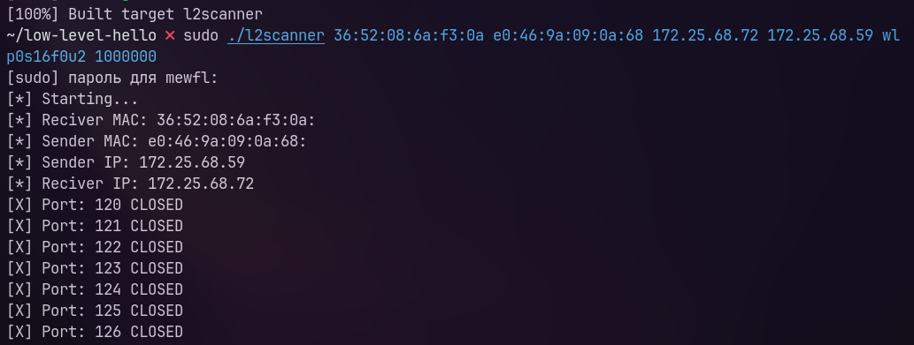

# L2Scanner



## Requirements
1. This utility working only on **Linux**.
2. For compile you can use **Clang/GCC** compilers.
3. Root

## Quick start
```bash
# Clone repository
git clone https://github.com/mental0-main/l2scanner.git
cd l2scanner

# Build
cmake .
make -j4

# Copy to "Path"
sudo install ./l2scanner /usr/local/bin

# And use
sudo l2scanner <dst_mac> <src_mac> <dst_ip> <src_ip> <interface> <timeout_usec>
```

## License
This project under with the *MIT LICENSE*.
